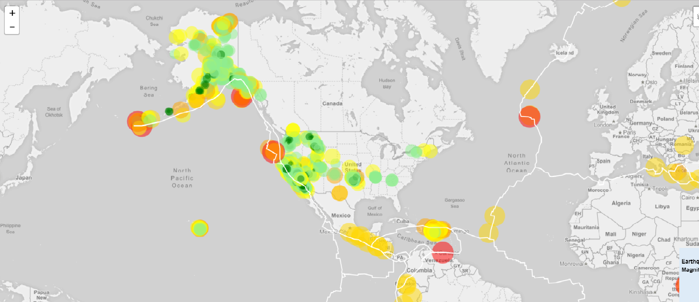
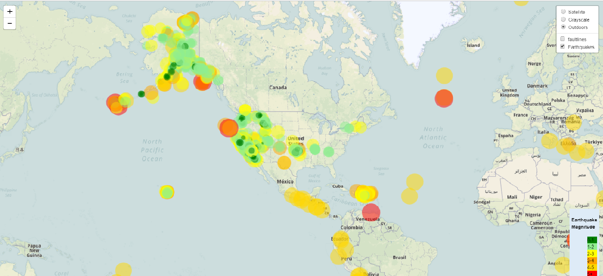
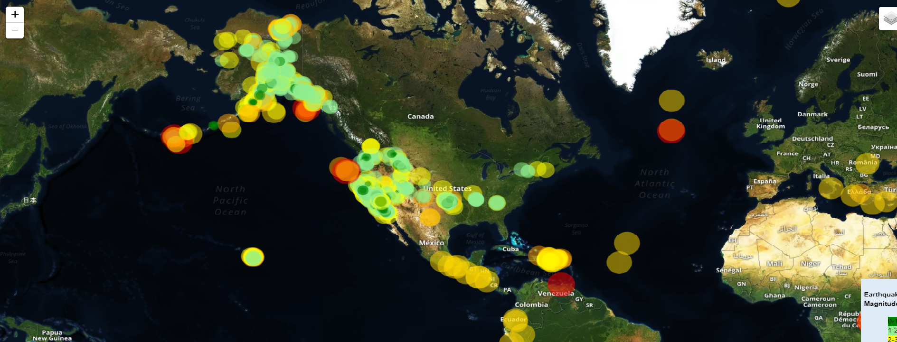

# Visualizing Data with Geo-mapping

Using the USGS data [USGS GeoJSON Feed](http://earthquake.usgs.gov/earthquakes/feed/v1.0/geojson.php) created a Visualization with leaflet that shows all earthquake data based on latitude and longitude. Pop-ups included with information of the marker when clicked. 

Additionally using tectonic data <https://github.com/fraxen/tectonicplates> alongside USGS plotted the faultines and incorporated in the drop-down with the base-maps.

